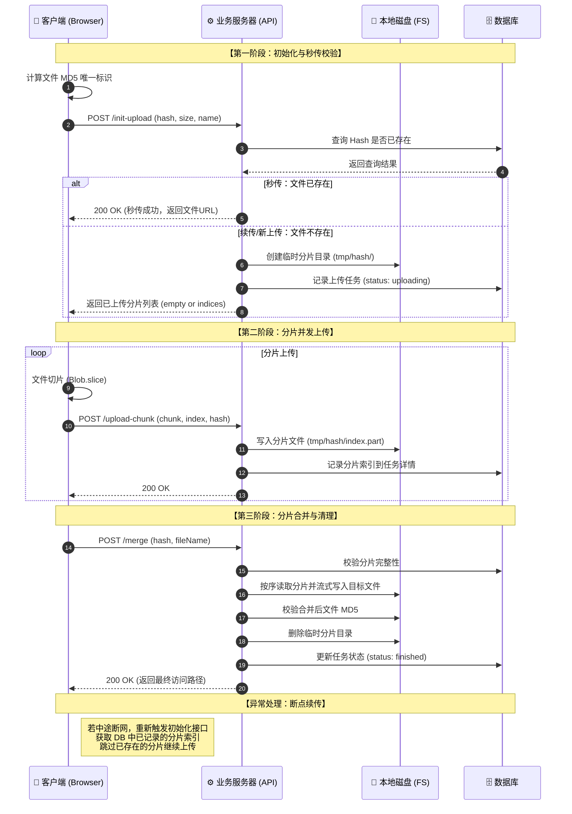

```mermaid
sequenceDiagram
    autonumber
    
    participant Client as 📱 客户端 (Browser)
    participant Server as ⚙️ 业务服务器 (API)
    participant LocalDisk as 💾 本地磁盘 (FS)
    participant DB as 🗄️ 数据库

    Note over Client, DB: 【第一阶段：初始化与秒传校验】
    
    Client->>Client: 计算文件 MD5 唯一标识
    Client->>Server: POST /init-upload (hash, size, name)
    
        Server->>DB: 查询 Hash 是否已存在
        DB-->>Server: 返回查询结果

    alt 秒传：文件已存在
        Server-->>Client: 200 OK (秒传成功，返回文件URL)
    else 续传/新上传：文件不存在
        Server->>LocalDisk: 创建临时分片目录 (tmp/hash/)
        Server->>DB: 记录上传任务 (status: uploading)
        Server-->>Client: 返回已上传分片列表 (empty or indices)
    end

    Note over Client, DB: 【第二阶段：分片并发上传】

    loop 分片上传
        Client->>Client: 文件切片 (Blob.slice)
        Client->>Server: POST /upload-chunk (chunk, index, hash)
        Server->>LocalDisk: 写入分片文件 (tmp/hash/index.part)
        Server->>DB: 记录分片索引到任务详情
        Server-->>Client: 200 OK
    end

    Note over Client, DB: 【第三阶段：分片合并与清理】

    Client->>Server: POST /merge (hash, fileName)
    
        Server->>DB: 校验分片完整性
        Server->>LocalDisk: 按序读取分片并流式写入目标文件
        Server->>LocalDisk: 校验合并后文件 MD5
        Server->>LocalDisk: 删除临时分片目录

    Server->>DB: 更新任务状态 (status: finished)
    Server-->>Client: 200 OK (返回最终访问路径)

    Note over Client, DB: 【异常处理：断点续传】
    Note right of Client: 若中途断网，重新触发初始化接口<br/>获取 DB 中已记录的分片索引<br/>跳过已存在的分片继续上传
```